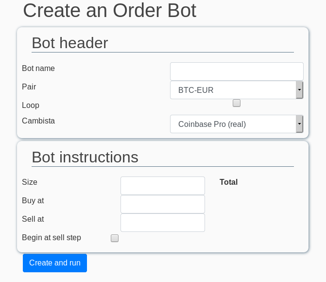
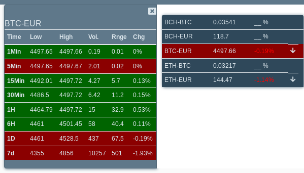

# virc

Virc aims to be a trading bot framework.

## Disclaimer
This product is in an early development stage. Cambista / Trader will send orders to Coinbase Pro, so you shoud'nt use them now, and later at your own risks.
Feel free to send me any observation.

## Requirements
docker, docker-compose. Tested on Debian.

## How to run it
in the vircapp directory, run
`docker-compose up -d`
you can read stats by running:
`docker logs -f virc-public_analyst_1`

Edit conf.env if needed. It provides the timezone and the pairs you want to operate on

In order to send real orders, you must generate a read-only key and a read-write key. Then edit vircapp/codedir/cambista/coinbase.json and vircapp/codedir/cambista/coinbase-rw.json .

open http://localhost:5000

## Structure
All the containers are in the same docker-compose. The is a back and a front network.

virc backend containers : 
* a mongodb server, which stores the market data in collections (the name of each collection is the pair name in lowercase, without dash, for example "btceur"
* a redis server, which provides the data shared between different containers (see below)
* Grabber get the market informations on the coinbase servers, via its API
* Analyst, calculates some market data, and sends it in the redis server.

virc frontend containers :
* Cambista is in charge to send orders to the coinbase API and informs the trader when an update is made.
* Cambista can be duplicated to be used also in the coinbase's sandbox.
* CambistaSim emulates locally your book order, generates and sends updates to trader 
* Trader spawns in its container the bots. It receives orders from redis lists.
* a GUI to define bots and monitor.

## Screenshots

_made in switzerland [+]_
